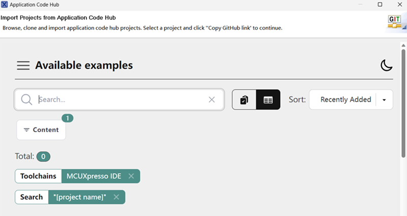
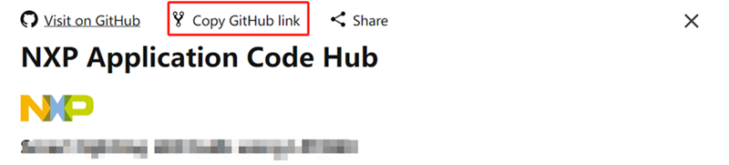
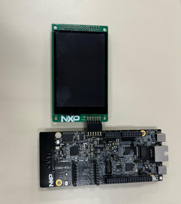
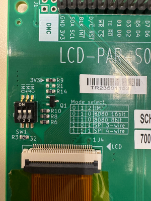
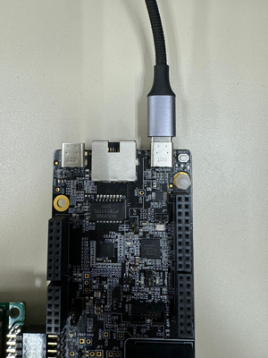

# NXP Application Code Hub

## Motion detection using FRDM RW612 Wi-Fi CSI
This demo showcases the Ambient Sensing capabilities of the FRDM-RW612 using Channel State Information (CSI), enabling presence and motion detection through a proprietary feature called Ambient Motion Index (AMI).

#### Boards: FRDM RW612
#### Categories: RTOS, Networking, Wireless Connectivity, Graphics
#### Peripherals: Wi-Fi, Display
#### Toolchains: MCUXpresso IDE, VS Code
#### SDK Version: 25.09.00

## Table of Contents
1. [Software](#step1)
2. [Hardware](#step2)
3. [Setup](#step3)
4. [Results](#step4)
5. [FAQs](#step5) 
6. [Support](#step6)
7. [Release Notes](#step7)

## 1. Software
- [MCUXpresso 24.12.148 or newer.](https://nxp.com/mcuxpresso)
- [MCUXpresso for VScode 1.5.61 or newer](https://www.nxp.com/products/processors-and-microcontrollers/arm-microcontrollers/general-purpose-mcus/lpc800-arm-cortex-m0-plus-/mcuxpresso-for-visual-studio-code:MCUXPRESSO-VSC?cid=wechat_iot_303216)
- [SDK for FRDM-RW612](https://mcuxpresso.nxp.com/en/select)

## 2. Hardware
- [FRDM-RW612](https://www.nxp.com/part/FRDM-RW612)
- [LCD-PAR-S035](https://www.nxp.com/part/LCD-PAR-S035#/)

## 3. Setup

### 3.1 Step 1
1. Open MCUXpresso IDE, in the Quick Start Panel, choose Import from Application Code Hub

2. Enter the demo name in the search bar.

3. Click Copy GitHub link, MCUXpresso IDE will automatically retrieve project attributes, then click Next>.

4. Select main branch and then click Next>, Select the MCUXpresso project, click Finish button to complete import.

### 3.2 Step 2

Connect the Low Cost Display to the board as shown in the following image:

Low Cost Display:

Make sure the LCD is configured to use SPI 4-wire

Connect the USB's type C from J10(MCU-LINK) to the computer as shown in the following image:

### 3.3 Prepare demo
1. Connect a USB cable between the host PC and the OpenSDA USB port on the target board.

2. Open a serial terminal with the following settings:
	- 115200 baud rate
	- 8 data bits
	- No parity
	- One stop bit
	- No flow control

3. Pre configure the AP SSID as "csi_test", Password as "1234567890" and AP Channel as "149" to speed up the AP connection.

4. Download the built image to the board through debug probe USB port and run the example.

## 4. Results
- Example pre-configures a AP to connect. SSID is "csi_test" and passphrase is "1234567890"
- Example will go into motion detection state once RW612 connects pre-configured AP successfully.
- Place your hand over the FRDM-RW612 and move it moderately.
- LCD screen will be lighted up if motion is detected and display a virtual keyboard.
- Input right password "9876", and smile face will show up. Sad face will be displayed if wrong password entered.
- LCD screen will turn off after 10s and start motion detection again.

## 5. FAQs
*Include FAQs here if appropriate. If there are none, then remove this section.*

## 6. Support
*Provide URLs for help here.*

#### Project Metadata

<!----- Boards ----->

<!----- Categories ----->

<!----- Peripherals ----->

<!----- Toolchains ----->

Questions regarding the content/correctness of this example can be entered as Issues within this GitHub repository.

>**Warning**: For more general technical questions regarding NXP Microcontrollers and the difference in expected functionality, enter your questions on the [NXP Community Forum](https://community.nxp.com/)

## 7. Release Notes
| Version | Description / Update                           | Date                        |
|:-------:|------------------------------------------------|----------------------------:|
| 1.0     | Initial release on Application Code Hub        | March 31st 2026 |

<small> <b>Trademarks and Service Marks</b>: There are a number of proprietary logos, service marks, trademarks, slogans and product designations ("Marks") found on this Site. By making the Marks available on this Site, NXP is not granting you a license to use them in any fashion. Access to this Site does not confer upon you any license to the Marks under any of NXP or any third party's intellectual property rights. While NXP encourages others to link to our URL, no NXP trademark or service mark may be used as a hyperlink without NXP’s prior written permission. The following Marks are the property of NXP. This list is not comprehensive; the absence of a Mark from the list does not constitute a waiver of intellectual property rights established by NXP in a Mark. </small>   <small> NXP, the NXP logo, NXP SECURE CONNECTIONS FOR A SMARTER WORLD, Airfast, Altivec, ByLink, CodeWarrior, ColdFire, ColdFire+, CoolFlux, CoolFlux DSP, DESFire, EdgeLock, EdgeScale, EdgeVerse, elQ, Embrace, Freescale, GreenChip, HITAG, ICODE and I-CODE, Immersiv3D, I2C-bus logo , JCOP, Kinetis, Layerscape, MagniV, Mantis, MCCI, MIFARE, MIFARE Classic, MIFARE FleX, MIFARE4Mobile, MIFARE Plus, MIFARE Ultralight, MiGLO, MOBILEGT, NTAG, PEG, Plus X, POR, PowerQUICC, Processor Expert, QorIQ, QorIQ Qonverge, RoadLink wordmark and logo, SafeAssure, SafeAssure logo , SmartLX, SmartMX, StarCore, Symphony, Tower, TriMedia, Trimension, UCODE, VortiQa, Vybrid are trademarks of NXP B.V. All other product or service names are the property of their respective owners. © 2021 NXP B.V. </small>